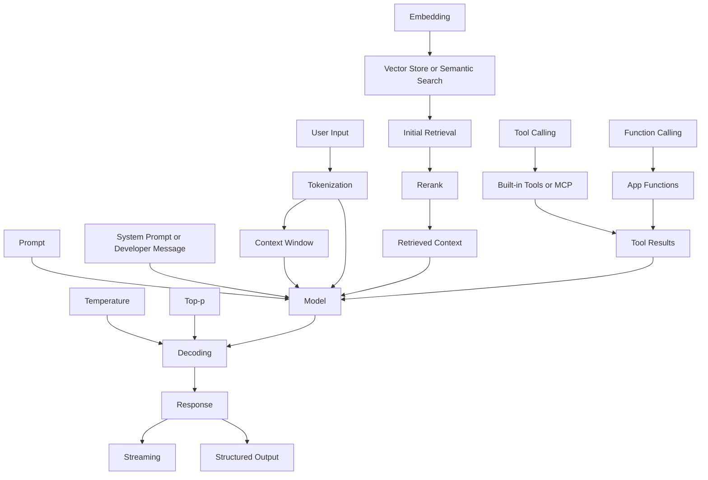

## 摘要

这组术语可以按工程栈分成四层来看。`Token` 与 `Context Window` 是资源预算层，决定一次请求能装多少信息、花多少钱、以及要不要先分块或摘要；`Prompt` 与 `System Prompt` 是行为控制层，用来规定任务、边界、格式与优先级；`Temperature`、`Top-p` 与 `Streaming` 是生成与传输层，分别影响采样随机性、候选截断方式和响应交付方式；`Embedding`、`Rerank`、`Tool Calling`、`Function Calling` 与 `Structured Output` 则属于“把模型接进系统”的能力层，决定模型如何检索外部知识、调用外部能力、以及以机器可消费的形式返回结果。

最常见的误区有三类。第一，很多人把 `Token` 当成“字数”或“词数”，但在 API 里它是模型内部的分词计量单位，和字符数、字数都不是一一对应关系；第二，很多人把 `Context Window` 当成“长期记忆”，其实它更接近“本轮可见工作内存”，超长对话会被裁剪或压缩，长上下文也不等于长程检索一定稳定；第三，很多人把 `Temperature`、`Top-p` 当成“准确率旋钮”，但它们本质上是采样控制，能改变多样性与稳定性，却不能单独保证事实正确。

当前术语还存在 API 命名演化。OpenAI 新文档更强调 `Responses API` 和 `developer` message；生态里仍广泛使用“system prompt”“function calling”等旧称。对新模型尤其是 reasoning 模型，官方明确指出 `developer` message 正在取代旧式 `system` message，而 `tool calling` 既可被当作 `function calling` 的近义词，也可作为更大的总类，涵盖内置工具、函数工具与 MCP 等外部能力。理解这种“历史名称”和“当前实现”并存的状态，是读懂现代 LLM API 的关键。

## 概念对照总表

| 概念 | 主要目的 | 常见值或范围 | 对输出或系统的典型影响 | 何时调整 |
|---|---|---|---|---|
| Token | 模型处理输入输出的基本计量单位；API 还区分 input、output、cached、reasoning tokens。 | 英文经验值约 1 token≈4 字符、≈¾ 个单词；精确值依模型与编码而变。 | 直接影响成本、上下文占用、可生成长度。 | 做成本估算、长文分块、定义很多 tools/schema 前先计数 |
| Context Window | 规定单次请求中模型可处理的 token 预算 | 依模型而变；官方 API 模型示例从数万到约百万 token, GPT-4.1 为 1,047,576，GPT-5.4 为 1,050,000 | 决定能否直接塞入大文档、代码库、多轮状态；长上下文也会增加成本，且复杂检索任务性能可能下降 | 文档很长、对话很长、要保留工具轨迹或多文件上下文时 |
| Prompt | 向模型提供输入、任务说明与约束；在 Responses API 中也可指可版本化的 prompt 对象 | 无固定数值；可为纯文本、messages、模板变量化 prompt object | 决定任务理解、格式、风格、边界和示例迁移效果 | 质量不稳定、输出格式混乱、需要团队复用 prompt 时 |
| System Prompt | 高优先级行为指令；在新模型上通常等价于 `developer` message 的职责 | 通常是一条放在最前面的高优先级约束消息；但平台级 system 消息也可能由 OpenAI 注入 | 强影响语气、格式、安全边界、工具策略与优先级 | 需要统一角色设定、输出规范、工具使用规则时 |
| Temperature | 采样温度，控制输出随机性 | 常见接口中通常为 0–2；默认常为 1部分 reasoning 模型不支持 | 高温更发散、更有创意；低温更集中、更稳定，但不等于事实更真 | 创意写作、探索式头脑风暴、或希望更稳定的提取/改写时 |
| Top-p | 核采样阈值，限制候选 token 的累计概率质量 | 0–1；1 近似不裁剪 官方通常建议与 temperature 二选一调 | 动态截断低概率长尾，常在保留多样性的同时减少极端词 | 希望精细控制采样候选空间，而不是整体缩放概率分布时 |
| Streaming | 增量返回响应事件，而不是等全文完成后一次返回 | 常见为 `stream=true`；HTTP 下多为 SSE，也可有 WebSocket 模式 | 显著改善可感知延迟与交互体验，但客户端处理更复杂 | 长输出、聊天 UI、语音实时系统、需要边生成边消费时 |
| Embedding | 把文本编码成向量，便于做相似度计算 | 浮点向量；OpenAI 新一代大模型嵌入可到 3072 维，且支持缩短维度 | 驱动语义检索、聚类、推荐、分类；维度越高通常效果更强但存储/检索成本更高 | 需要 RAG、语义搜索、去重、聚类或标签传播时 |
| Rerank | 对首轮检索出的候选重新排序，提高前几名质量。 | 常见做法是对首轮 top-N 候选做二阶段重排；N 取决于延迟预算。 | 往往提高 precision@k，但增加额外推理或规则计算成本。 | 语义检索“有点准但不够准”、业务规则强、候选噪声高时。 |
| Tool Calling | 给模型提供外部能力，如 web search、file search、MCP、函数工具。 | `tools` 数组；能力类型取决于模型与端点。 | 让模型具备最新信息、文件访问与系统操作能力，但带来外部失败面与编排复杂度。 | 需要“知道训练集之外的信息”或“做动作”时。 |
| Function Calling | 以 JSON Schema 描述自定义函数，让模型返回参数化调用请求。 | 常见字段是 `name`、`description`、`parameters`、`strict`。 | 把自然语言稳健地转成应用函数调用，但函数定义本身也占上下文 token。 | 需要数据库查询、业务 API、工作流自动化时。 |
| Structured Output | 让模型输出严格符合给定 JSON Schema 的结果。 | 两大形态：函数调用中的 `strict:true`，或响应端的 `json_schema` / `text.format`。 | 大幅提高机器可解析性与稳定性；首个新 schema 可能有额外延迟，且只支持部分 JSON Schema。 | 抽取、表单、工作流编排、UI 生成、评测和数据管道时。 |

## 概念关系图

下图把这 12 个术语放回一个典型 LLM 应用流水线中：输入先被 token 化并受 context budget 约束，prompt/system prompt 决定任务与优先级，temperature/top-p 决定采样策略，streaming 决定怎么把结果交付给前端；如果系统启用了 embedding、retrieval、rerank、tools、functions 和 structured output，则模型会与外部知识和外部系统发生受控交互。



从交互关系看，有三条最重要的“耦合线”。第一，`tools`、函数 schema、长 prompt、文件与图像都会消耗 token，并进一步挤压 `context window`；第二，`embedding` 负责“找候选”，`rerank` 负责“从候选里挑最值得喂给模型的上下文”；第三，`structured output` 与 `function calling` 都依赖 schema，但前者约束“最后给用户/系统的答案格式”，后者约束“模型发给应用的调用参数格式”。`streaming` 不改变这些语义关系，只改变返回方式。

## 输入与上下文控制

### Token

**权威定义**：OpenAI 将 token 定义为模型处理文本的基本单位；它可能是单个字符、完整单词、子词、空格或标点。API 还显式区分 input tokens、output tokens、cached tokens 和 reasoning tokens。OpenAI 的 Model Spec 进一步把 token 视为输入输出长度的内部计量单位。

**通俗解释**：token 不是“一个字”也不是“一个单词”，更像模型内部的“字节级/子词级筹码”。你真正付费、占上下文、限制输出长度的，都不是字符数，而是 token 数。对英文，官方经验值约为 1 token≈4 个字符；但中文、多模态输入、工具 schema 都会让这个经验值失效，所以估算只能粗用，正式上线前应精确计数。

**典型用例与示例**：最典型的工程动作是“发请求前先数 token”，尤其在你传入 messages、图片、文件、工具定义或大型 JSON schema 时。OpenAI 现在提供 `responses.input_tokens.count`，它比本地按字符估算更可靠，因为它会把工具、schema 和模型特定行为一起算进去。

```python
from openai import OpenAI

client = OpenAI()

resp = client.responses.input_tokens.count(
    model="gpt-5",
    input=[{"role": "user", "content": "请把这段合同摘要成 5 个要点。"}],
)

print(resp.input_tokens)
```

```javascript
import OpenAI from "openai";

const client = new OpenAI();

const resp = await client.responses.input_tokens.count({
  model: "gpt-5",
  input: [{ role: "user", content: "请把这段合同摘要成 5 个要点。" }],
});

console.log(resp.input_tokens);
```

**影响与权衡**：更多 token 往往意味着更高成本、更高延迟和更小的“剩余输出空间”。同时，复杂工具定义与 schema 虽然能提高能力与可靠性，但它们本身也会占用输入 token；官方明确说明函数定义会计入上下文并按输入 token 计费。

**常见误解与澄清**：最常见误解是“token 就是字符数/词数”。不是。甚至同一个单词在句中位置不同、大小写不同，token ID 也可能不同；OpenAI 也明确建议精确计数时使用 Tokenizer 工具或 `tiktoken`，而不是继续用 `characters / 4` 这类经验公式。另一个误解是“只有自然语言才占 token”；实际上工具定义、图像/文件引用和 schema 也会占。

**相关参数与交互**：`Context Window` 是 token 的总预算；`max output tokens` 决定输出侧留多少；`cached tokens` 影响成本；函数定义和 structured schemas 会推高输入 token；reasoning 模型还可能额外使用 reasoning tokens。

**进一步阅读**：OpenAI Help《What are tokens and how to count them》、OpenAI《Counting tokens》、OpenAI `tiktoken` 仓库。

### Context Window

**权威定义**：在 OpenAI 帮助文档中，模型有“maximum combined token limit (input + output)”；在具体模型页中，官方又把它拆成 `context window` 与 `max output tokens`。例如 GPT-4.1 标注 1,047,576 context window 与 32,768 max output，GPT-5.4 标注 1,050,000 context window 与 128,000 max output。

**通俗解释**：把 context window 想成模型本轮“工作内存”更准确。它不是长期记忆，也不是“模型知道的世界知识”；它只是这一次请求里模型能看到、能计算的 token 总量。对话太长时，旧内容会被截断或压缩；上下文再大，也不代表模型一定能无损记住每个角落。

**典型用例与示例**：常见用法包括长文问答、仓库级代码理解、把工具调用轨迹与文件片段一并放进请求，以及为 agent 保留中间状态。工程上最稳妥的做法，不是“盲塞进去试一把”，而是“先计数，再给输出留余量，再决定直接送还是分块/摘要”。

```python
from openai import OpenAI

client = OpenAI()

payload = [{"role": "user", "content": long_text}]
count = client.responses.input_tokens.count(model="gpt-4.1", input=payload)

budget_for_input = 900_000  # 给输出和系统消息留余量
if count.input_tokens > budget_for_input:
    raise ValueError("输入过长：请先分块、摘要，或改用检索/RAG。")

response = client.responses.create(model="gpt-4.1", input=payload)
print(response.output_text)
```

```javascript
import OpenAI from "openai";

const client = new OpenAI();

const payload = [{ role: "user", content: longText }];
const count = await client.responses.input_tokens.count({
  model: "gpt-4.1",
  input: payload,
});

const budgetForInput = 900_000; // 给输出和系统消息留余量
if (count.input_tokens > budgetForInput) {
  throw new Error("输入过长：请先分块、摘要，或改用检索/RAG。");
}

const response = await client.responses.create({
  model: "gpt-4.1",
  input: payload,
});

console.log(response.output_text);
```

**影响与权衡**：更大的窗口让你能少做分块和多轮拼接，但代价通常是更高的成本与更重的注意力负担。OpenAI 在 GPT-4.1 提示指南中明确指出，虽然 1M 输入上下文在“针找草堆”类测试里表现很好，但随着需要检索的项目数增多，或需要跨全局状态做复杂推理，长上下文性能会下降。对某些模型，超长上下文还有额外定价规则。

**常见误解与澄清**：第一，context window 不是“长度越大越强”；很多任务里，“检索后喂最相关的 10 段”比“喂入 10 万段”更好。第二，它不是“永久记忆”；Model Spec 明确说明当会话过长时，历史会被截断且优先保留新的、相关的信息。第三，它不等于纯输入上限；工程上必须给输出、系统/开发者消息和工具轨迹预留空间。

**相关参数与交互**：它与 token 数直接耦合；与 `max output tokens` 共同组成预算；与 prompt、tool definitions、structured schemas、function outputs、retrieved context 都会相互挤占空间。长上下文任务中，OpenAI 还建议把重要指令放在上下文前后两端，而不是只放一侧。

**进一步阅读**：GPT-4.1 Prompting Guide 的 long context 章节、OpenAI《Counting tokens》、OpenAI 模型页。

### Prompt

**权威定义**：OpenAI 将 prompting 定义为“向模型提供输入的过程”；同时在当前 API 文档中，`prompt` 还可以指一个长期存在、可版本化、可模板化并可在团队间共享的 prompt object。

**通俗解释**：狭义上，prompt 就是你发给模型的任务指令；广义上，它是“任务描述 + 上下文 + 示例 + 限制 + 输出要求”的组合。现代 API 里，prompt 既可以是一次性的裸文本，也可以是经过版本管理的可复用配置对象。

**典型用例与示例**：最典型的高质量 prompt 通常同时包含任务、边界、格式和示例。OpenAI 的文档持续强调“更具体、更明确、更可验证”的提示方式能显著提高可控性；对长上下文任务，还要刻意安排指令位置。

```python
from openai import OpenAI

client = OpenAI()

response = client.responses.create(
    model="gpt-5.5",
    input="""
任务：把下面文本总结成 3 条要点。
要求：
- 每条不超过 20 个字
- 不要重复原句
- 输出为 JSON 数组

文本：
<text>
这里放你的长文本……
</text>
""",
)

print(response.output_text)
```

```javascript
import OpenAI from "openai";

const client = new OpenAI();

const response = await client.responses.create({
  model: "gpt-5.5",
  input: `
任务：把下面文本总结成 3 条要点。
要求：
- 每条不超过 20 个字
- 不要重复原句
- 输出为 JSON 数组

文本：
<text>
这里放你的长文本……
</text>
`,
});

console.log(response.output_text);
```

**影响与权衡**：prompt 的核心作用不是“增加知识”，而是“重新组织目标函数”。好的 prompt 能把模型从“会说”变成“按规格说”；但 prompt 越长、规则越多，也越可能因为冲突、歧义或顺序问题导致脆弱性。GPT-4.1 指南特别指出，模型更字面地遵从指令，所以提示词工程越来越像“写接口契约”，而不是“写咒语”。

**常见误解与澄清**：一是“prompt engineering 是堆砌花哨格式”。其实官方更强调具体、清晰、可验证和少歧义。二是“prompt 越长越好”。不一定；尤其在新模型上，短而明确、结果导向的提示经常比冗长流程提示更稳。三是“prompt 只是文本内容”。在 Responses API 中，它也可以是带版本与变量的 prompt object。

**相关参数与交互**：和 prompt 最直接相关的是 few-shot examples、delimiters、message roles、prompt caching、prompt object versioning，以及 context placement。Prompt 质量也决定了 structured output、tool calling 和 retrieval 注入的表现上限。

**进一步阅读**：OpenAI《Prompting》、OpenAI《Prompt engineering》、微软官方中文《提示工程技术》。

### System Prompt

**权威定义**：在 Model Spec 中，conversation 的 `role` 可包含 `system`、`developer`、`user`、`assistant` 和 `tool`；其中 system message 是 OpenAI 可注入的平台级消息，developer message 是开发者提供的高优先级指令。OpenAI 当前 API 参考明确写到：对 o1 及更新模型，`developer` messages 用来取代先前的 `system` messages；reasoning best practices 也把 “developer messages are the new system messages” 写得很清楚。

**通俗解释**：生态里说“system prompt”，通常指“放在最前面、优先级高于用户输入的全局行为说明”。但在 OpenAI 的最新语义里，这个职责正在从旧 `system` 角色转向更明确的 `developer` 角色；真正的平台级 system 往往由 OpenAI 持有，不完全等同于开发者在代码里写的那条“系统提示”。

**典型用例与示例**：system/developer 层最适合放角色定义、输出格式约束、工具使用规范、业务政策与风格边界，而把具体问题、输入数据和例子放在 user 层。微软官方中文文档也把系统消息定位为“引导行为、语气和输出格式”的主要位置。

```python
from openai import OpenAI

client = OpenAI()

resp = client.chat.completions.create(
    model="gpt-4.1",
    messages=[
        {
            "role": "developer",
            "content": "你是企业客服助手。始终输出 JSON；如果信息不足，明确返回 unknown。"
        },
        {
            "role": "user",
            "content": "订单 12345 到哪里了？"
        },
    ],
)

print(resp.choices[0].message.content)
```

```javascript
import OpenAI from "openai";

const client = new OpenAI();

const resp = await client.chat.completions.create({
  model: "gpt-4.1",
  messages: [
    {
      role: "developer",
      content: "你是企业客服助手。始终输出 JSON；如果信息不足，明确返回 unknown。",
    },
    {
      role: "user",
      content: "订单 12345 到哪里了？",
    },
  ],
});

console.log(resp.choices[0].message.content);
```

**影响与权衡**：system/developer 层的最大价值在于“全局稳定性”。它能显著抬高输出的一致性与对规范的遵从度；但写得太硬，会牺牲适应性，甚至与用户请求或 few-shot 示例发生冲突。Model Spec 采用的是“authority chain”而不是“最后一句覆盖一切”的逻辑，因此建设性做法不是无限往 system prompt 里塞规则，而是把真正跨请求稳定的规则上移，把任务细节下沉到 user prompt。

**常见误解与澄清**：一是“system prompt 可以覆盖平台规则”，不能；平台/安全层优先级更高。二是“system prompt 越长越好”，不对；冗长规则会制造内部冲突并增加 token 成本。三是“现在 system prompt 这个概念已经没用了”，也不对；只是你在新模型上更应该用 `developer` message 来承担这个角色。

**相关参数与交互**：它与 `Prompt`、message roles、tool policy、structured output 约束、reasoning model formatting 直接互动。对 reasoning 模型，官方还说明如果你想重新启用 Markdown，需要在 developer message 第一行显式写 `Formatting re-enabled`。

**进一步阅读**：OpenAI Model Spec、OpenAI《Reasoning best practices》、微软官方中文《Azure OpenAI 的系统消息设计》。

## 采样与传输

在解码层，`Temperature` 与 `Top-p` 都是“从概率分布里怎么选下一个 token”的控制器；官方一再建议通常只调其中一个，而不要同时把两个旋钮都大幅改动。与此同时，`Streaming` 不改变模型挑 token 的方式，而改变这些 token 何时、如何被你的前端或后端接收。

### Temperature

**权威定义**：微软官方的 OpenAI 兼容参数文档把 temperature 定义为“0 到 2 之间的采样温度”；更高值如 0.8 会使输出更随机，更低值如 0.2 会使输出更集中、更确定。

**通俗解释**：temperature 可以理解为“让概率分布更尖还是更平”的旋钮。低温趋向于更常见、更稳的 token；高温会让低概率 token 更容易被采到，于是风格更发散、词汇更多样。

**典型用例与示例**：低温常见于抽取、摘要、改写、分类；高温更适合创意文案、标题探索、角色化生成。需要注意的是，当前一些 reasoning 模型不支持 `temperature` 与 `top_p`，更推荐使用 `reasoning.effort` 之类的新控制项。

```python
from openai import OpenAI

client = OpenAI()

# 更稳定：摘要/改写
precise = client.chat.completions.create(
    model="gpt-4.1",
    temperature=0.2,
    messages=[{"role": "user", "content": "把这段会议记录改写成正式纪要：..."}],
)

# 更发散：创意文案
creative = client.chat.completions.create(
    model="gpt-4.1",
    temperature=0.9,
    messages=[{"role": "user", "content": "给这款咖啡写 10 个广告标题。"}],
)

print(precise.choices[0].message.content)
print(creative.choices[0].message.content)
```

```javascript
import OpenAI from "openai";

const client = new OpenAI();

// 更稳定：摘要/改写
const precise = await client.chat.completions.create({
  model: "gpt-4.1",
  temperature: 0.2,
  messages: [{ role: "user", content: "把这段会议记录改写成正式纪要：..." }],
});

// 更发散：创意文案
const creative = await client.chat.completions.create({
  model: "gpt-4.1",
  temperature: 0.9,
  messages: [{ role: "user", content: "给这款咖啡写 10 个广告标题。" }],
});

console.log(precise.choices[0].message.content);
console.log(creative.choices[0].message.content);
```

**影响与权衡**：temperature 越高，多样性通常越高，但稳定性与复现性越差。OpenAI 还强调聊天补全本质上默认是非确定性的；低 temperature 能提高一致性，却不等于“事实正确”或“跨版本完全复现”。

**常见误解与澄清**：第一，`temperature=0` 并不保证绝对确定性，尤其在模型升级、seed 不同或服务端实现细节变化时。第二，低温不等于高事实性；它只是更偏向高概率词。第三，并非所有模型都支持调温度，reasoning 模型上这点尤其需要查模型文档。

**相关参数与交互**：最直接的交互对象是 `top_p`；官方通常建议二选一调。另一个相关概念是 `seed`，它比低温更接近“提高复现实验性”的工具。对 reasoning 模型，则更多使用 `reasoning.effort` 而不是传统采样参数。

**进一步阅读**：微软官方中文参数参考、OpenAI《Advanced usage》中的可复现输出说明。

### Top-p

**权威定义**：官方兼容文档把 `top_p` 定义为 nucleus sampling（核采样）的概率质量阈值；例如 `0.1` 表示只从累计概率前 10% 的 token 集合中采样。Holtzman 等人在《The Curious Case of Neural Text Degeneration》中把 nucleus sampling 定义为：从覆盖大部分概率质量的动态“核”中采样，以截断不可靠的长尾。

**通俗解释**：如果说 temperature 是“把整张概率分布压扁或拉尖”，那 top-p 更像“只保留最靠谱的一小片候选池”。模型非常确定时，这个池子会很小；模型很不确定时，池子会自动变大，所以它比固定 top-k 更自适应。

**典型用例与示例**：在一些需要保留自然性但不想放太多低概率奇异词的任务里，top-p 往往比单纯拉高 temperature 更稳定。官方仍建议不要和 temperature 同时大幅调，通常只调一个。

```python
from openai import OpenAI

client = OpenAI()

response = client.chat.completions.create(
    model="gpt-4.1",
    top_p=0.9,  # 只保留累计概率质量前 90% 的候选
    messages=[{"role": "user", "content": "给旅行 App 写 5 条自然一点的欢迎文案。"}],
)

print(response.choices[0].message.content)
```

```javascript
import OpenAI from "openai";

const client = new OpenAI();

const response = await client.chat.completions.create({
  model: "gpt-4.1",
  top_p: 0.9, // 只保留累计概率质量前 90% 的候选
  messages: [{ role: "user", content: "给旅行 App 写 5 条自然一点的欢迎文案。" }],
});

console.log(response.choices[0].message.content);
```

**影响与权衡**：较低的 top-p 会压缩候选空间，通常让输出更“收敛”；较高的 top-p 会扩展候选空间，保留更多多样性。Holtzman 的论文说明 nucleus sampling 的动机正是避免纯最大似然或固定截断策略导致的枯燥、重复或失真。

**常见误解与澄清**：top-p 不是“准确率阈值”，也不是“只保留前 p% 的词表大小”；它保留的是**累计概率质量**而不是固定数量。另一个误解是“top-p 比 temperature 高级，所以应该总是优先用 top-p”；工程上并没有绝对规则，关键是看任务对稳定性与多样性的要求。

**相关参数与交互**：与 temperature 最强交互，通常二选一调；对 reasoning 模型，同样可能不支持。在需要高复现时，比起同时改 top-p 和 temperature，更应该先固定 prompt、模型版本和 seed。

**进一步阅读**：Holtzman 等《The Curious Case of Neural Text Degeneration》、微软官方中文参数参考。

### Streaming

**权威定义**：OpenAI 官方把 streaming 定义为：默认情况下 API 会在完整输出生成完后一次返回，而开启 `stream=true` 后，可在输出尚未生成完时开始打印或处理前半段；HTTP 流式模式基于 server-sent events（SSE）。

**通俗解释**：streaming 改变的是“什么时候收到结果”，不是“模型本身怎么思考”。它的核心价值是降低**可感知等待时间**：用户先看到开头，系统也能先消费部分结果，而不是干等整段结束。

**典型用例与示例**：典型场景包括聊天 UI、长篇写作、语音实时接口、边生成边渲染 JSON 字段、以及边收到函数参数边准备执行调用。官方还专门指出，structured outputs 也可以流式解析，但推荐依赖 SDK 帮你处理。

```python
from openai import OpenAI

client = OpenAI()

stream = client.responses.create(
    model="gpt-5.5",
    input=[{"role": "user", "content": "请分三段解释什么是向量数据库。"}],
    stream=True,
)

for event in stream:
    print(event)
```

```javascript
import { OpenAI } from "openai";

const client = new OpenAI();

const stream = await client.responses.create({
  model: "gpt-5.5",
  input: [{ role: "user", content: "请分三段解释什么是向量数据库。" }],
  stream: true,
});

for await (const event of stream) {
  console.log(event);
}
```

**影响与权衡**：streaming 的好处是 UX 更好、首字节更快、后端可早处理；坏处是客户端需要事件循环、增量拼接、错误回滚和结束条件处理。若配合 structured output 或 function calling，还要处理字段 delta、参数 delta 与 done 事件。

**常见误解与澄清**：第一，streaming 不必然降低总生成时间，它主要降低的是“等待全部完成再看到结果”的体验成本。第二，streaming 不等于“逐 token”；在事件流里你看到的是分块与多种事件类型，而不是严格一 token 一包。第三，流式 JSON 并不天然好解析，structured output 的 SDK 辅助很重要。

**相关参数与交互**：它与 `Structured Output`、`Function Calling` 的交互很强，因为函数参数与结构化字段都可能以 delta 形式增量出现。需要持久连接和双向增量时，则可以考虑 WebSocket/Realtime，而不只是 HTTP SSE。

**进一步阅读**：OpenAI《Streaming API responses》、OpenAI《Structured Outputs》里的 streaming 小节、微软官方中文《Azure OpenAI 中的内容流式处理》。

## 表征与检索

### Embedding

**权威定义**：OpenAI 把 embedding 定义为一串浮点数向量，用来衡量文本串之间的相关性；向量距离越小，相关性通常越高。OpenAI 还在产品博客里把 embedding 描述为“表示自然语言或代码中概念的数字序列”，便于机器学习模型理解内容间关系。

**通俗解释**：embedding 就是把文本扔进一个“语义坐标系”。“退货政策”和“怎么退款”虽然关键词不同，但在好的 embedding 空间里会互相靠近，所以它特别适合做语义搜索，而不仅是关键词匹配。

**典型用例与示例**：官方列出的常见场景包括 search、clustering、recommendations、anomaly detection、classification。当前 OpenAI 的嵌入 API 直接返回向量；你通常会把它存到向量库，再用 cosine similarity 或向量索引做召回。

```python
from openai import OpenAI

client = OpenAI()

resp = client.embeddings.create(
    model="text-embedding-3-small",
    input="退货政策与退款时效"
)

vector = resp.data[0].embedding
print(len(vector), vector[:8])
```

```javascript
import OpenAI from "openai";

const client = new OpenAI();

const resp = await client.embeddings.create({
  model: "text-embedding-3-small",
  input: "退货政策与退款时效",
  encoding_format: "float",
});

const vector = resp.data[0].embedding;
console.log(vector.length, vector.slice(0, 8));
```

**影响与权衡**：embedding 模型越强、维度越大，通常语义检索效果越好，但存储、索引和查询成本也更高。OpenAI 在 2024 的嵌入更新里特别强调，新模型支持 `dimensions` 参数做“缩短嵌入”，例如 `text-embedding-3-large` 最长可到 3072 维，也可裁成更短以换取更低存储与延迟成本。

**常见误解与澄清**：第一，embedding 不是“模型已经理解你的业务”，它只是一个表示空间；检索效果仍受 chunking、查询改写、索引和数据质量影响。第二，embedding 不是生成接口，不能直接拿来“回答问题”。第三，更高维度不是永远更值，很多业务里 256/1024 维的压缩向量已经足够。

**相关参数与交互**：它与 chunking、vector store、similarity metric、retrieval、rerank 强耦合。embedding 负责高效大规模召回；如果你还想把前几名做得更准，下一步通常是 rerank。

**进一步阅读**：OpenAI《Vector embeddings》、OpenAI《New embedding models and API updates》、微软官方中文《了解如何生成嵌入内容》与《教程：在 Microsoft Foundry 模型嵌入和文档搜索中探索 Azure OpenAI》。

### Rerank

**权威定义**：OpenAI Cookbook 把 rerank 描述为：当你已经用 embeddings 或其他 bi-encoder 做了首轮语义检索，但结果还不够准时，可再用更准确但更慢的 cross-encoder 或额外规则对候选重新排序。Nogueira 与 Cho 的《Passage Re-ranking with BERT》则把实时检索管线明确拆成“先标准机制取回大量可能相关文档，再做 passage reranking”。

**通俗解释**：retrieval 解决的是“先别漏”，rerank 解决的是“前几名要真准”。它不会把没召回到的东西凭空变出来，但会显著改善“喂给模型的前 k 段”的质量。

**典型用例与示例**：最轻量的 rerank 是“按语义分数 + 业务规则”重排，比如把更近的时间、更高权威、更高点击率稍微往前提；更强的做法是 cross-encoder 或 LLM-based rerank。OpenAI 的 file_search 工具本身也会在生成最终答案前对搜索结果做内部 rerank。

```python
# 轻量业务规则 rerank：先用 embedding/检索拿到候选，再二次排序
candidates = [
    {"id": "a", "semantic_score": 0.82, "days_old": 1},
    {"id": "b", "semantic_score": 0.80, "days_old": 30},
    {"id": "c", "semantic_score": 0.78, "days_old": 2},
]

def rerank_score(x):
    recency = max(0, 30 - x["days_old"]) / 30
    return 0.9 * x["semantic_score"] + 0.1 * recency

top_k = sorted(candidates, key=rerank_score, reverse=True)[:2]
print(top_k)
```

```javascript
// 轻量业务规则 rerank：先用 embedding/检索拿到候选，再二次排序
const candidates = [
  { id: "a", semantic_score: 0.82, days_old: 1 },
  { id: "b", semantic_score: 0.80, days_old: 30 },
  { id: "c", semantic_score: 0.78, days_old: 2 },
];

function rerankScore(x) {
  const recency = Math.max(0, 30 - x.days_old) / 30;
  return 0.9 * x.semantic_score + 0.1 * recency;
}

const topK = [...candidates]
  .sort((x, y) => rerankScore(y) - rerankScore(x))
  .slice(0, 2);

console.log(topK);
```

**影响与权衡**：rerank 的典型收益是 precision@k 提升，尤其对 FAQ、客服、法律、科研搜索很明显；代价是它比纯 embedding 召回更慢，也更贵。Cookbook 还明确指出，cross-encoder 比 bi-encoder 更准确但扩展性差，所以最佳实践是先做便宜的首轮召回，再对较短候选列表重排。

**常见误解与澄清**：第一，rerank 不是 retrieval 的替代品；它只能重排你已经取回的候选。第二，rerank 也不是非得用 LLM；业务规则、交叉编码器、点击反馈都可以。第三，往往不是“重排越多越好”，而是“候选数 N 与延迟预算要平衡”。

**相关参数与交互**：它与 embedding、vector search、hybrid retrieval、top-k chunk selection 强绑定。OpenAI 的示例里，hybrid 流程通常是“搜索/召回 → rerank → answer”；而在某些托管工具中，这一步已经由系统内置完成。

**进一步阅读**：OpenAI Cookbook《Search reranking with cross-encoders》、OpenAI Cookbook《Question answering using a search API and re-ranking》、Nogueira & Cho《Passage Re-ranking with BERT》。

## 工具、函数与结构化输出

### Tool Calling

**权威定义**：OpenAI《Using tools》把 tools 描述为扩展模型能力的机制，涵盖 built-in tools、function calling、tool search 和 remote MCP servers；这些能力可让模型搜索网络、检索文件、延迟加载工具定义、调用你的函数或访问第三方服务。

**通俗解释**：tool calling 让模型不再只会“说”，而是能“查”和“连”。当模型意识到仅靠参数知识不足以回答时，它可以请求使用 web search、file search 或你暴露的外部能力。

**典型用例与示例**：最容易上手的是内置 `web_search`。它适合新闻、行情、天气、产品信息等高时效场景。对开发者来说，tool calling 应被理解为“在受控白名单里给模型额外能力”，而不是“给它互联网全权限”。

```python
from openai import OpenAI

client = OpenAI()

response = client.responses.create(
    model="gpt-5.5",
    tools=[{"type": "web_search"}],
    input="今天有哪些对开发者有利的 AI 新闻？"
)

print(response.output_text)
```

```javascript
import OpenAI from "openai";

const client = new OpenAI();

const response = await client.responses.create({
  model: "gpt-5.5",
  tools: [{ type: "web_search" }],
  input: "今天有哪些对开发者有利的 AI 新闻？",
});

console.log(response.output_text);
```

**影响与权衡**：使用 tools 的最大收益是能接入最新信息、私有文件和外部系统；最大的代价是把一次纯文本生成，变成带依赖、带状态、带失败面、带权限边界的编排系统。工具结果也会进入上下文，从而增加 token 使用。

**常见误解与澄清**：第一，tool calling 不意味着模型自动“拥有工具”；你必须显式声明。第二，tool 使用不是总会发生；模型会根据提示与工具描述决定是否调用。第三，tool calling 不是只有函数；OpenAI 语境里它也包含内置 web/file search、MCP 和 tool search。

**相关参数与交互**：`tools`、`tool_search`、`parallel_tool_calls`、message roles、tool outputs，以及 function calling 都是它的直接邻居。对复杂 agent，tool policy 常常应该写进 developer/system prompt。

**进一步阅读**：OpenAI《Using tools》、OpenAI《Responses API》相关指南。

### Function Calling

**权威定义**：OpenAI 官方把 function calling 描述为一种让模型连接到外部数据与动作的方式：开发者用 JSON Schema 定义函数，模型在需要时返回函数调用请求与参数，应用执行后再把结果回传模型。官方同时注明，function calling 也常被称为 tool calling。

**通俗解释**：function calling 不是“模型自己执行函数”，而是“模型帮你把自然语言翻译成一个结构化调用意图”。真正执行数据库、HTTP API、退款、发邮件的仍然是你的程序。

**典型用例与示例**：典型场景包括天气查询、CRM 读取、订单操作、SQL 生成、UI 操作和工作流节点触发。当前最佳实践是使用严格 schema，尽量把函数描述写成稳定接口契约。OpenAI 还提醒，函数定义本身会被注入并计入上下文 token。

```python
from openai import OpenAI
import json

client = OpenAI()

def get_weather(location: str) -> str:
    return f"{location}: 26°C, 晴"

tools = [{
    "type": "function",
    "name": "get_weather",
    "description": "获取某地当前天气。",
    "parameters": {
        "type": "object",
        "properties": {
            "location": {"type": "string"}
        },
        "required": ["location"],
        "additionalProperties": False
    },
    "strict": True
}]

first = client.responses.create(
    model="gpt-5",
    input="请告诉我巴黎现在的天气。",
    tools=tools,
)

for item in first.output:
    if item.type == "function_call" and item.name == "get_weather":
        result = get_weather(json.loads(item.arguments)["location"])
        second = client.responses.create(
            model="gpt-5",
            tools=tools,
            input=first.output + [{
                "type": "function_call_output",
                "call_id": item.call_id,
                "output": result,
            }],
        )
        print(second.output_text)
```

```javascript
import OpenAI from "openai";

const client = new OpenAI();

function getWeather(location) {
  return `${location}: 26°C, 晴`;
}

const tools = [{
  type: "function",
  name: "get_weather",
  description: "获取某地当前天气。",
  parameters: {
    type: "object",
    properties: {
      location: { type: "string" }
    },
    required: ["location"],
    additionalProperties: false
  },
  strict: true,
}];

const first = await client.responses.create({
  model: "gpt-5",
  input: "请告诉我巴黎现在的天气。",
  tools,
});

for (const item of first.output) {
  if (item.type === "function_call" && item.name === "get_weather") {
    const { location } = JSON.parse(item.arguments);
    const result = getWeather(location);

    const second = await client.responses.create({
      model: "gpt-5",
      tools,
      input: [
        ...first.output,
        {
          type: "function_call_output",
          call_id: item.call_id,
          output: result,
        },
      ],
    });

    console.log(second.output_text);
  }
}
```

**影响与权衡**：function calling 最大的优势是把自然语言系统化为可验证的参数结构；最大代价是你必须设计好 schema、实现执行器、做权限控制、失败重试和结果校验。官方 API 参考也特别提醒：如果不是 strict 模式，模型生成的参数可能不是有效 JSON，甚至会幻觉出 schema 中没有的字段。

**常见误解与澄清**：第一，函数被“调用”不等于函数被“执行”；执行端始终在你的应用。第二，函数调用返回的参数也不是天然可信，仍应做服务端验证。第三，function calling 与 tool calling 在很多文章里混用，但在更精细的当前语义里，function 是 tool 的一种。

**相关参数与交互**：`strict:true`、`parallel_tool_calls`、tool descriptions、reasoning items、structured outputs 都与之强相关。对 reasoning 模型，OpenAI 还建议在多步函数流程里把相邻 reasoning items 一并传回，以减少模型重复推理。

**进一步阅读**：OpenAI《Function calling》、OpenAI 2023 年《Function calling and other API updates》、微软官方中文《如何在 Microsoft Foundry 模型中通过 Azure OpenAI 使用函数调用》。

### Structured Output

**权威定义**：OpenAI 把 Structured Outputs 定义为“让模型输出可靠地遵守开发者提供的 JSON Schema”的能力。官方明确区分两种形式：一是在函数调用里通过 `strict:true` 约束参数；二是在模型直接回应用户时，通过 `json_schema` response format 或 `text.format` 约束最终输出。官方还明确指出：Structured Outputs 是 JSON mode 的演进，JSON mode 仅保证有效 JSON，不保证 schema adherence。

**通俗解释**：如果 function calling 更像“让模型发一个结构化 API 请求”，那 structured output 更像“让模型直接返回一条严格可解析的结构化答案”。这对抽取、评测、表单、前端 UI 生成和自动化流水线特别关键。

**典型用例与示例**：OpenAI 官方示例覆盖了事件抽取、数学分步结果、研究论文抽取、UI 生成和 moderation。当前 SDK 直接支持 Python 的 Pydantic 类与 JavaScript 的 Zod schema。

```python
from pydantic import BaseModel
from openai import OpenAI

client = OpenAI()

class CalendarEvent(BaseModel):
    name: str
    date: str
    participants: list[str]

resp = client.responses.parse(
    model="gpt-4o-2024-08-06",
    input=[
        {"role": "system", "content": "Extract the event information."},
        {"role": "user", "content": "Alice and Bob are going to a science fair on Friday."},
    ],
    text_format=CalendarEvent,
)

print(resp.output_parsed)
```

```javascript
import OpenAI from "openai";
import { z } from "zod";
import { zodTextFormat } from "openai/helpers/zod";

const client = new OpenAI();

const CalendarEvent = z.object({
  name: z.string(),
  date: z.string(),
  participants: z.array(z.string()),
});

const resp = await client.responses.parse({
  model: "gpt-4o-2024-08-06",
  input: [
    { role: "system", content: "Extract the event information." },
    { role: "user", content: "Alice and Bob are going to a science fair on Friday." },
  ],
  text: {
    format: zodTextFormat(CalendarEvent, "event"),
  },
});

console.log(resp.output_parsed);
```

**影响与权衡**：Structured Outputs 的最大价值是把“尽量输出对的 JSON”提升到“输出满足给定 schema 的 JSON”。但它不是零代价：官方说明首个新 schema 可能有额外延迟，且只支持 JSON Schema 的一个子集；如果模型选择拒绝不安全请求，或生成在 `max_tokens` 前截断，也可能无法得到完整结构。

**常见误解与澄清**：第一，structured output 保证的是**结构正确**，不是**字段值一定正确**；官方明确提醒，值内容仍可能出错。第二，JSON mode 不等于 structured output；前者只保“合法 JSON”，后者才保“符合 schema”。第三，很多人以为 response schema 与函数 schema 可以随意并行叠加；官方说明严格 structured outputs 与 parallel function calls 并不兼容，必要时应设 `parallel_tool_calls:false`。另外，在 JSON mode 下如果你没明确要求输出 JSON，模型甚至可能持续输出空白流，所以必须在上下文中明确提到 JSON。

**相关参数与交互**：它和 function calling 共享 schema 思维，但目标不同：function calling 约束“调用参数”，response format / `text.format` 约束“最终答案”。它还与 `refusal` 检测、streaming 字段解析、tool policies 和 max tokens 直接相互作用。

**进一步阅读**：OpenAI《Structured model outputs》、OpenAI《Introducing Structured Outputs in the API》、微软官方中文《结构化输出》。